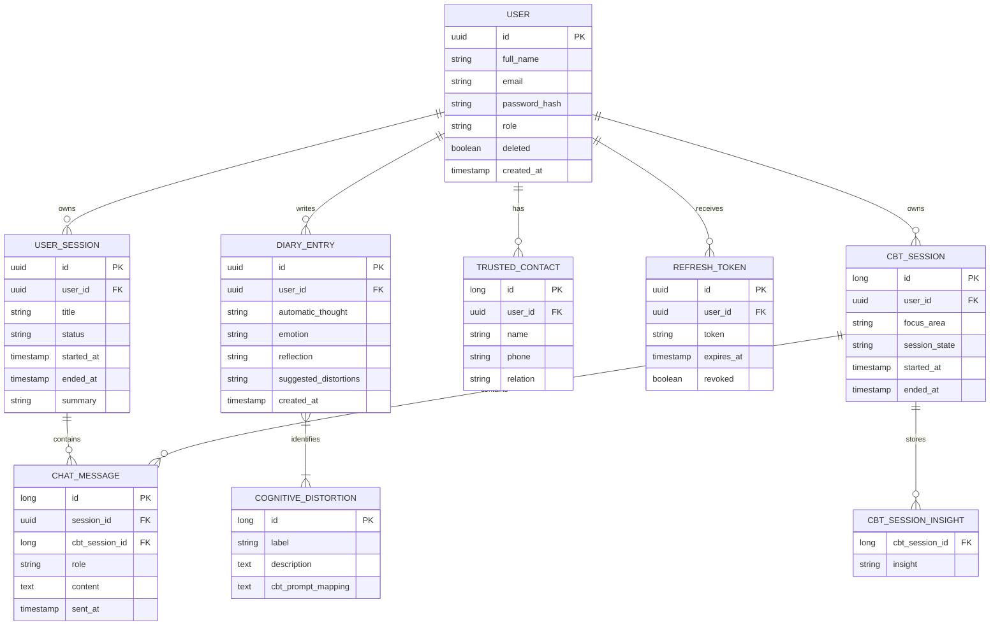

```mermaid
erDiagram
    USER ||--o{ USER_SESSION : owns
    USER ||--o{ DIARY_ENTRY : writes
    USER ||--o{ TRUSTED_CONTACT : has
    USER ||--o{ REFRESH_TOKEN : receives
    USER ||--o{ CBT_SESSION : owns
    USER_SESSION ||--o{ CHAT_MESSAGE : contains
    CBT_SESSION ||--o{ CHAT_MESSAGE : contains
    DIARY_ENTRY }|--|{ COGNITIVE_DISTORTION : identifies
    CBT_SESSION ||--o{ CBT_SESSION_INSIGHT : stores

    USER {
        uuid id PK
        string full_name
        string email
        string password_hash
        string role
        boolean deleted
        timestamp created_at
    }
    USER_SESSION {
        uuid id PK
        uuid user_id FK
        string title
        string status
        timestamp started_at
        timestamp ended_at
        string summary
    }
    DIARY_ENTRY {
        uuid id PK
        uuid user_id FK
        string automatic_thought
        string emotion
        string reflection
        string suggested_distortions
        timestamp created_at
    }
    COGNITIVE_DISTORTION {
        long id PK
        string label
        text description
        text cbt_prompt_mapping
    }
    TRUSTED_CONTACT {
        long id PK
        uuid user_id FK
        string name
        string phone
        string relation
    }
    CHAT_MESSAGE {
        long id PK
        uuid session_id FK
        long cbt_session_id FK
        string role
        text content
        timestamp sent_at
    }
    CBT_SESSION {
        long id PK
        uuid user_id FK
        string focus_area
        string session_state
        timestamp started_at
        timestamp ended_at
    }
    CBT_SESSION_INSIGHT {
        long cbt_session_id FK
        string insight
    }
    REFRESH_TOKEN {
        uuid id PK
        uuid user_id FK
        string token
        timestamp expires_at
        boolean revoked
    }
```
